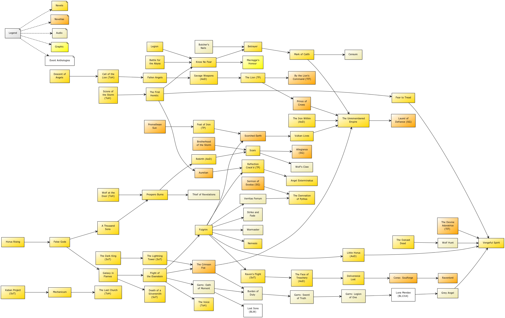

# Книги по Warhammer40k

Порядок чтения книг по вселенной разнится. Некоторые фанаты составляют схемы порядке их прочтения, но в целом можно следовать по дате их публикации. Схема порядка прочтения от фанатов прикреплена к сообщению.

## Цикл книг "Ересь Хоруса"

Ересь Хоруса — цикл произведений разных авторов по вселенной «Warhammer 40000». Серия включает как отдельные романы, так и сборники повестей и рассказов.

Horus Rising by Dan Abnett (2006)

False Gods by Graham McNeill (2006)

Galaxy in Flames by Ben Counter (2006)

The Flight of the Eisenstein by James Swallow (2007)

Fulgrim by Graham McNeill (2007)

Descent of Angels by Mitchel Scanlon (2007)

Legion by Dan Abnett (2008)

Battle for the Abyss by Ben Counter (2008)

Mechanicum by Graham McNeill (2008)

Tales of Heresy by Various Authors (2009)

Fallen Angels by Mike Lee (2009)

A Thousand Sons by Graham McNeill (2010)

Nemesis by James Swallow (2010)

The First Heretic by aaron Dembski-Bowden (2010)

Prospero Burns by Dan Abnett (2010)

Age of Darkness by Various Authors (2011) [Anthology]

The Outcast Dead by Graham McNeill (2011)

Deliverance Lost by Gav Thorpe (2011)

Know No Fear by Dan Abnett (2012)

The Primarchs by Various Authors (2012) [Anthology]

Fear to Tread by James Swallow (2012)

Shadows of Treachery by Various Authors (2012) [Anthology]

Angel Exterminatus by Graham McNeill (2013)

Betrayer by Aaron Dembski-Bowden (2013)

Mark of Calth by Various Authors (2013) [Anthology]

Vulkan Lives by Nick Kyme (2013)

The Unremembered Empire by Dan Abnett (2013)

Scars by Chris Wraight (2014)

Vengeful Spirit by Graham McNeill (2014)

The Damnation of Pythos by David Annandale (2014)

Legacies of Betrayal (2015) by Various Authors [Anthology]

Deathfire by Nick Kyme (2015)

War Without End by Various Authors (2016) [Anthology]

Pharos by Guy Haley (2016)

Eye of Terra by Various Authors (2017) [Anthology]

The Path of Heaven by Chris Wraight (2016)

The Silent War by Various Authors (2016) [Anthology]

Angels of Caliban by Gav Thorpe (2016)

Praetorian of Dorn by John French (2017)

Corax by Gav Thorpe (2017) [Anthology]

The Master of Mankind by Aaron Dembski-Bowden (2017)

Garro: Weapons of Fate by James Swallow (2017) [Anthology]

Shattered Legions by Various Authors (2017) [Anthology]

The Crimson King by Graham McNeill (2017)

Tallarn by John French (2017) [Anthology]

Ruinstorm by David Annandale (2017)

Old Earth by Nick Kyme (2017)

The Burden of Loyalty by Various Authors (2018) [Anthology]

Wolfsbane by Guy Haley (2018)

Born of Flame by Nick Kyme (2018) [Anthology]

Slaves to Darkness by John French (2018)

Heralds of the Siege by Various Authors (2018) [Anthology]

Titandeath by Guy Haley (2018)

The Buried Dagger by James Swallow (2019)

## Цикл Осада Терры

После завершения 54-й книги Ереси Хоруса серия завершилась. Книги по осаде Терры заняли их место как основная серия книг по вселенной.

The Solar War by John French (2019)

The Lost and the Damned by Guy Haley (2019)

The First Wall by Gav Thorpe (2020)

The Sons of Selenar by Graham McNeill (2020) [Novella]

Saturnine by Dan Abnett (2020)

Fury of Magnus by Graham McNeill (2021) [Novella]

Mortis by John French (2021)

Warhawk by Chris Wraight (2021)

## Цикл примархов

Помимо цикла про Ересь Хоруса есть новеллы про примархов, которые можно читать в любом порядке

Roboute Guilliman: Lord of Ultramar by David Annandale (2016)

Leman Russ: The Great Wolf by Chris Wraight (2016)

Magnus the Red: Master of Prospero by Graham McNeill (2017)

Perturabo: The Hammer of Olympia by Guy Haley (2017)

Lorgar: Bearer of the Word by Gav Thorpe (2017)

Fulgrim: The Palatine Phoenix by Josh Reynolds (2017)

Ferrus Manus: The Gorgon of Medusa by David Guymer (2018)

Jaghatai Khan: Warhawk of Chogoris by Chris Wraight (2018)

Vulkan: Lord of Drakes by David Annandale (2018)

Sons of the Emperor by Various Authors (2018) [Anthology]

Corax: Lord of Shadows by Guy Haley (2018)

Angron: Slave of Nuceria by Ian St. Martin (2019)

Scions of the Emperor by Various Authors (2019) [Anthology]

Konrad Curze: The Night Haunter by Guy Haley (2019)

Lion El’Jonson: Lord of the First by David Guymer (2020)

Alpharius: Head of the Hydra by Mike Brooks (2021)

Blood of the Emperor by Various Authors (2021) [Anthology]

Mortarion: The Pale King by David Annandale (Expected: September 27, 2022)

