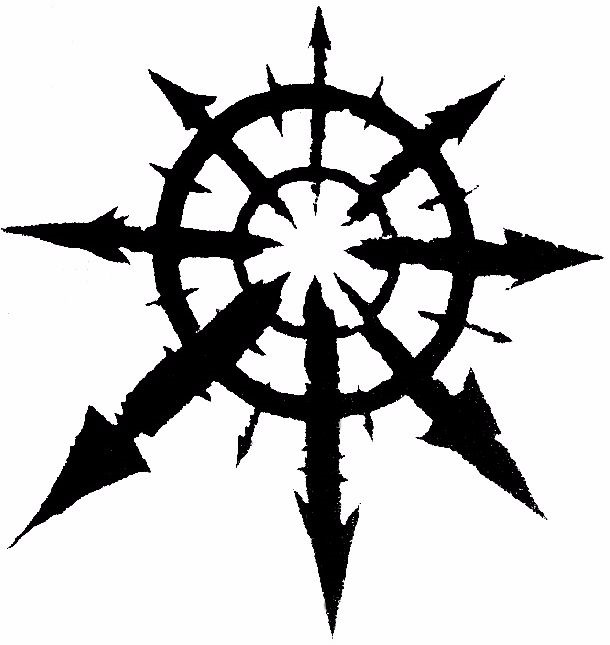
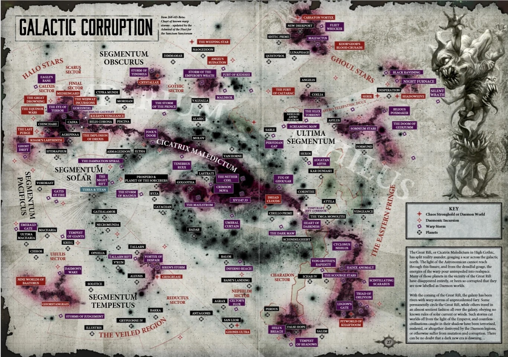
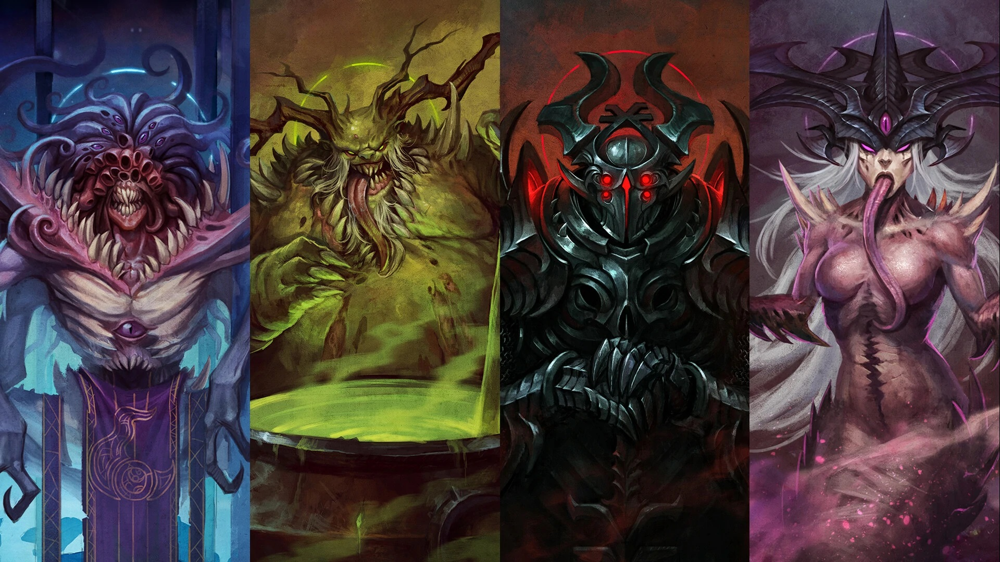

*Хаос*

Хаос — психическая энергия, из которой состоит варп-пространство. Чаще всего, «Хаосом» называют всё, связанное с ним, включая его влияние, Богов Хаоса, их последователей, а также сам варп. Хаос это почти синоним варпа, эти сущности неразделимы: Хаос — бесконечный океан духовной и эмоциональной энергии, который наполняет варп. Это великая и незамутнённая сила изменений и мощи, и она физически и духовно развращает. Наиболее одарённые смертные, псайкеры, могут использовать эту энергию, которая даёт им способности, легко переступающие законы материальной вселенной. Однако, злобная сила Хаоса со временем может извратить псайкера, разлагая его душу и разум.

Каноничный знак Хаоса — восьмиконечная звезда, символизирующая бесконечные возможности Хаоса.

*Боги Хаоса*

Хаос воплощён в четырёх основных полуматериальных сущностях, называемых Тёмными Богами. Каждый из этого могущественного пантеона является совершенно оригинальным существом со своей суверенной сферой влияния. Несмотря на то, что Хаос уже «разделён» на четырёх богов, каждый из них всё равно столь ментально огромен, что не имеет физического воплощения и остаётся существом исключительно варпа, что однако не мешает каждому иметь огромное количество слуг и рабов среди демонов и материальных рас, особенно людей.

- Кхорн — бог войны и крови.
- Нургл — бог гниения и болезней.
- Тзинч — бог амбиций, надежд и жажды перемен.
- Слаанеш — бог чувственных удовольствий, садизма и безумия.

*Воинство Хаоса*

Войска Хаоса представлены четырьмя основными видами:

*Демоны*

Демоны — это сущности Хаоса, находящиеся на следующей ступеньке иерархической лестницы после Богов. Их великое множество, и в большинстве своем каждый из них подчиняется какому-нибудь Богу. Иногда демоны напрямую вторгаются в миры людей и прочих рас, но чаще предпочитают действовать опосредованно, привлекая на свою сторону слабых или обиженных личностей, легко поддающихся их влиянию. Каждый демон, после своего воплощения в реальном пространстве, — сам по себе является оружием, наделённым той или иной степенью собственной воли. Запретные учения говорят о тайных именах демонов, зная которые, можно контролировать их владельцев, а также о том, что если демон потерпит поражение в материальном мире, то не сможет вернуться на протяжении определенного срока.

Наиболее могущественные из демонов Хаоса имеют способность влиять на изменения в материальной вселенной и принимают лишь поклонение себе как божествам, также именуемым как Тёмные Боги или Четверо Великих. Когда не имеется в виду определённое божество, то говорят о Хаосе Неделимом.

Особым объектом внимания демонов Хаоса являются разумные существа, использующие энергию Хаоса — псайкеры.

Демоны Хаоса способны принимать физическую форму, но не могут ее долго удерживать. Поэтому им приходится пользоваться услугами живых существ, способных стать проводниками их сущности. Они умело используют человеческие слабости, сея лживые обещания и сомнения, разжигая огонь анархии в сердцах живых, помогая им добиваться власти для увеличения числа своих почитателей и открывая себе дорогу в реальный мир. В различных местах возникают общины, в явной или завуалированной форме почитающие богов Хаоса. Общины поднимают восстания, уничтожают властные структуры городов, регионов или целых планет и переманивают на свою сторону магов или псайкеров. Итогом может стать возникновение мощнейшего всплеска психической энергии, изменяющего реальность и открывающего демонам путь в материальный мир. Лояльной половине человечества приходится постоянно бороться с такими проявлениями.

*Заблудшие и Проклятые*

Заблудшие и Проклятые — широкое разнообразие хаоситов-мятежников и мутантов, включающее в себя выродившихся людей, зверолюдей, культистов, беглых псайкеров, мутантов с демонических миров и предателей из Имперской Гвардии. При слабом вооружении, их группировки стараются превосходить врага числом.

*Космодесант Хаоса*

Космические десантники Хаоса — те, кто перешёл на сторону Воителя Хоруса и восстал против Императора в попытке поставить материальный мир на службу Хаоса. Целых девять легионов предали Императора и присоединились к Хаосу, и некоторые из них выбрали себе отдельное божество для поклонения, а другие поклоняются Хаосу Неделимому.

*Легионы титанов Хаоса*

Легионы титанов Хаоса — легионы Коллегия Титаника, которые покорились Хаосу, обратившись против Империума во время Ереси Хоруса. Они используют боевых титанов, заражённых силами Хаоса, что делает их самыми ненавистными врагами Адептус Механикус.

*Другие*

Многие расы и цивилизация попали под влияние Хаоса. Среди таких — Скафилиды, Лаэр, Ю'ват, Сарути и Ксенархи.

