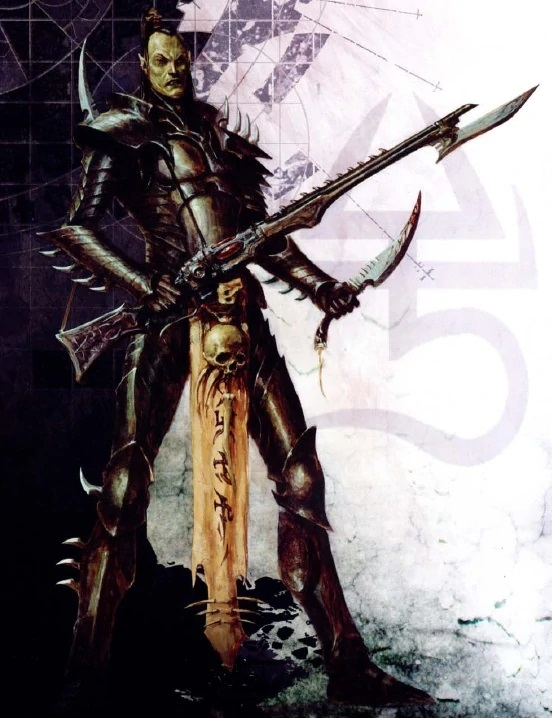

*Тёмные эльдары*

Друкхари (Aeldarix malum) (произносится как Druh-KAR-ee) или «Темные» в лексиконе эльдар, также известные посторонним как Темные эльдары, — это покинутые и коррумпированные сородичи альдари, садистские и злонамеренные аналоги асурьяни. Как и их родственники из искусственных миров, друкари — древняя и высокоразвитая инопланетная раса фей-гуманоидов.

Альтернативный термин «Темные эльдар», или эладрит Иннеас на языке эльдари, впервые был придуман архонтом друкари и Верховным владыкой Комморры Асдрубаэлем Вектом в 32-м тысячелетии.

Армии друкари, как и их коллеги-эльдари из искусственных миров, обычно обладают преимуществами мобильности и передовых технологий, хотя им часто не хватает устойчивости и численности.

Друкхари упиваются пиратством, порабощением и пытками и до крайности садисты. Армии друкари используют различные антигравитационные скиммеры, такие как Рейдеры и Опустошители, для запуска высокоскоростных атак.

Они наносят удар практически без предупреждения, используя межпространственный лабиринт, известный как Паутина, для безопасного и гораздо более быстрого пересечения галактики, чем большинство продвинутых видов, путешествующих по звездам, могут совершать варп-прыжки.

Друкари уникальны среди разумных рас Галактики Млечный Путь, потому что они не живут в оседлых мирах или мирах, а, скорее, большая часть их населения сосредоточена в одном грязном городе-государстве — Темном Городе Комморра, который находится в «упорядоченном» Имматериуме Паутины Аэлдари.

Друкхари в основном пираты и работорговцы, которые охотятся на цели по всей галактике, чтобы утолить свой нечестивый аппетит к душам других разумных существ, ужасное желание, называемое «Жажда», хотя иногда они используются в качестве наемников другими звездными расами.

Друкхари — живое воплощение всего распутного и жестокого в характере альдари. Очень умные и хитрые до одержимости, эти пираты упиваются физической и эмоциональной болью других, потому что питаться психическими остатками страданий — единственный способ предотвратить медленное поглощение Богом Хаоса Слаанеш их собственных душ.

Друкхари, особенно их касты воинов, высокие, гибкие, белокожие гуманоиды. Их алебастровая кожа подобна смерти в своей бледности, потому что в их темном царстве нет настоящего живительного солнца, чтобы обеспечить цвет.

Их спортивные тела определяются мышцами хлыста, сформированными и улучшенными до тех пор, пока они не станут в среднем физически сильнее, чем их коллеги-эльдари из мира-корабля, поскольку друкари высоко ценят физическую и боевую доблесть.

Тем не менее, несмотря на всю свою физическую красоту, по человеческим меркам друкари по-прежнему остаются отвратительными монстрами.

При взгляде ведьмовским зрением псайкера раскрываются черные души друкари, ибо они вечно жаждут только психической энергии страданий и мучений других мыслящих существ, чтобы заполнить свою собственную бесконечную пустоту.

В отличие от своих двоюродных братьев-эльдар из искусственного мира, друкари не интегрируют свои все еще мощные скрытые психические способности в свою культуру и действительно питают большое презрение к псайкерам любого рода.

Это связано с тем, что для друкари использование экстрасенсорных способностей только еще больше привлечет к ним внимание «Ты, что жаждет» (Слаанеш), ​​а их души уже достаточно рискуют быть поглощенными Принцем Хаоса.

