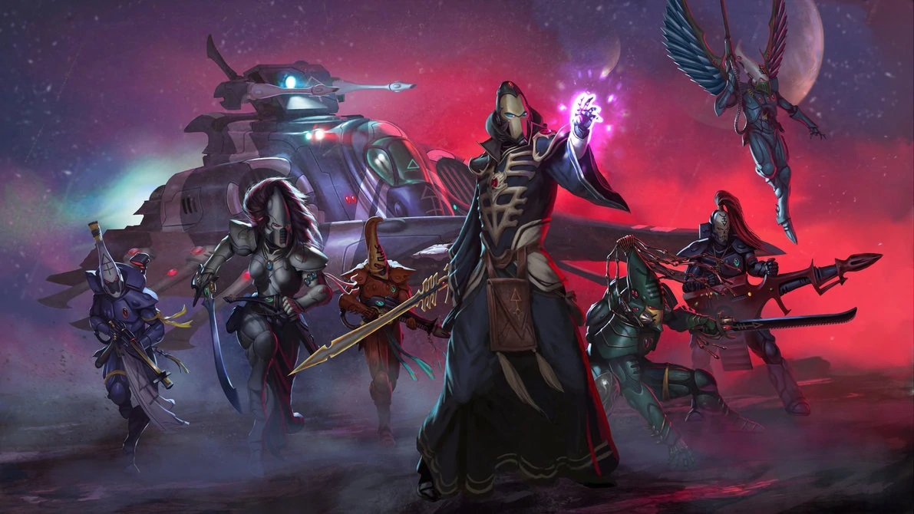
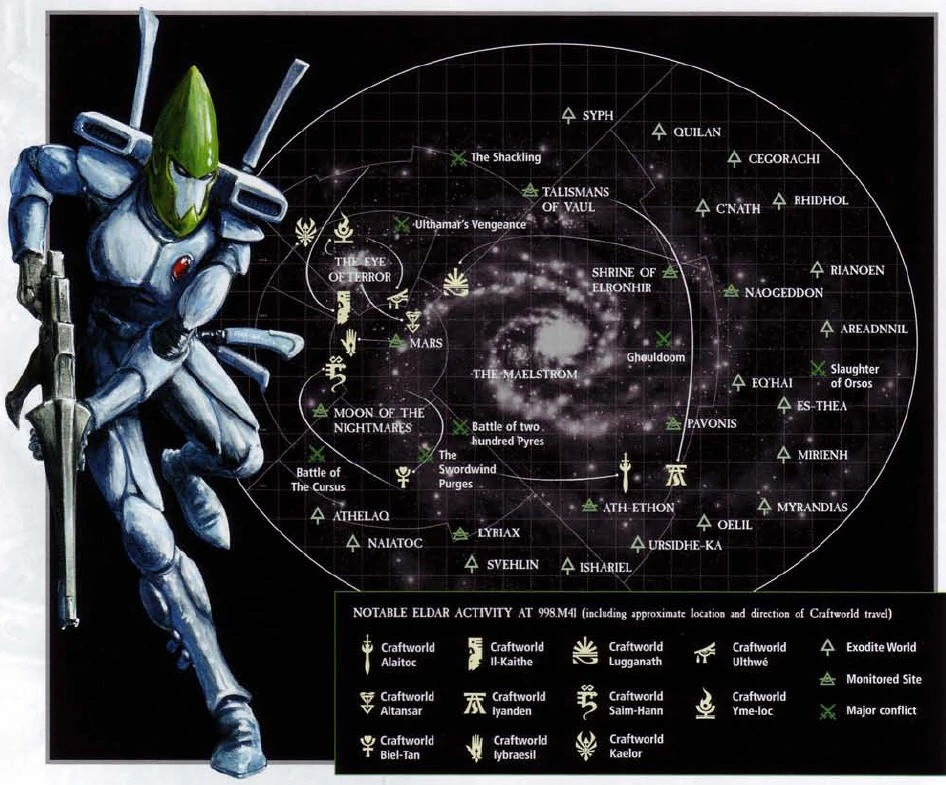

# Эльдары

Азурьяны (Aeldarix dolosus) («Дети Азуриана» в словаре эльдар), также называемые эльдари мира-кораблей, как они были названы до падения их потерянного царства, или эльдар, как они были давно известны посторонним, являются древним гуманоидным пришельцем. видов, чья обширная империя когда-то простиралась на всю ширину и ширину известной галактики. Асурьяни — сородичи расы альдари, которые сейчас живут на огромных, похожих на города космических кораблях, называемых искусственными мирами.

Империи Эльдари не было равных, и они считали себя повелителями звезд. Но более десяти тысячелетий назад самонадеянная гордость альдари и их впадение в гедонистические практики привели к катаклизму, который почти полностью уничтожил их вид и привел к рождению бога Хаоса Слаанеша.

Несмотря на их безграничную мощь, сердце их цивилизации было вырвано из-за этой катастрофы, которую они сами же и устроили, заставив многих выживших альдари, теперь называющих себя «эльдар» для чужаков и «асурьяни» между собой, бежать на гигантский континент- размер звездолетов, когда-то использовавшихся для коммерции и торговли, которые они назвали искусственными мирами. Теперь азурианцы цепляются за выживание, сражаясь с ужасами галактики с помощью ритуальной ментальной дисциплины и непревзойденного боевого мастерства.

Асурьяне полагаются на мистические технологии, такие как психокристаллические камни духа и психоактивные цепи бесконечности из призрачной кости, которые составляют скелеты их искусственных миров, чтобы хранить их души после смерти и предотвращать их потребление Слаанешем.

Именно использование этих технологий и их стремление к жесткой системе модификации поведения, чтобы держать под контролем свои темные импульсы, формируют образ жизни азурианцев и определяют их культуру, отличную от культуры других субкультур эльдар.

Раса альдари имеет долгую и сложную космическую историю, настолько долгую, что мало что известно о ходе их физической эволюции и раннем существовании на планетах. Первоначальный родной мир альдари был разрушен во время катастрофического краха цивилизации эльдар, известного как Падение эльдари.

Остатки культуры эльдар, пережившие катаклизм среди асурьянцев, сохранили большую часть истории своего вида в виде традиционных историй, песен и танцев. Письменные записи, памятники и визуальные записи были почти полностью уничтожены, за исключением нескольких случаев, когда они были взяты на борт космических кораблей, спасающихся от обреченных миров.

Как гуманоидная раса, Эльдари физически очень похожи на людей, хотя ни в коем случае не полностью идентичны. У них более длинные и чистые конечности, тонкие аскетические черты лица с проницательными и слегка раскосыми миндалевидными глазами.

Их уши также слегка заострены, но в остальном они могли бы с первого взгляда сойти за людей. Наиболее очевидную разницу между людьми и альдари можно увидеть только тогда, когда они двигаются, поскольку движения альдари излучают утонченную грацию, которой человек не может подражать.

Это видно даже по их малейшим жестам или ловкости, с которой они манипулируют мелкими предметами.

Разум эльдар, хотя в целом и похож на человеческую психику, гораздо более склонен к эмоциональным крайностям. Из-за этого эльдари более умны, но и гораздо более интенсивны, чем люди.

Хотя и альдари, и люди могут испытывать горе или радость, опыт альдари, вероятно, будет гораздо более экстремальным.

Эта естественная склонность к эмоциональным крайностям является одновременно и благословением, и проклятием для альдари. С положительной стороны, это дает им беспрецедентную оценку жизни и непревзойденную способность выражать себя через музыку и другие творческие усилия.

Мелодия или жест, сделанные грациозно и искусно, могут вызвать интенсивность удовольствия, невообразимую для человека.

Но этот потенциал радости сочетается с равной способностью испытывать отчаяние, амбиции и даже ненависть. Столкнувшись с горем или другими личными неудачами, альдари терпят душевные муки, которые намного превосходят пределы человеческих страданий.

Экстремальный характер их темперамента делает очень важным, чтобы альдари всегда сохраняли некоторую степень самоконтроля, поскольку они опасно легко могут быть очарованы и в конечном итоге зависеть от опыта, который предлагает им их культура.

Они должны научиться контролировать темную сторону своей натуры, которая является не менее важной частью психики альдари и источником катастрофы, чуть не ставшей причиной их исчезновения.

По этой причине асурьяни определяются как культура благодаря их следованию Пути Асурьяни. Эта философия учит их, как сбалансировать свой мощный разум и преследовать созидательные цели, а не впадать в аморальную погоню за удовольствиями и эгоизмом, которые в конечном итоге уничтожили древних эльдар и до сих пор определяют их темных сородичей, друкари.

Эльдари — раса, обладающая естественными психическими способностями, и все асурьянцы обладают потенциалом стать могущественными псайкерами, если решат пойти по этому пути. Асурьяни могут использовать эти врожденные способности для формирования материи, что лежит в основе их необычайного владения технологиями.

Несмотря на то, что они высоко развиты и внушают страх всей галактике, эльдари мира-корабля все еще являются умирающим народом в конце 41-го тысячелетия — тенью их былой славы — и их вид балансирует на грани окончательного уничтожения.

