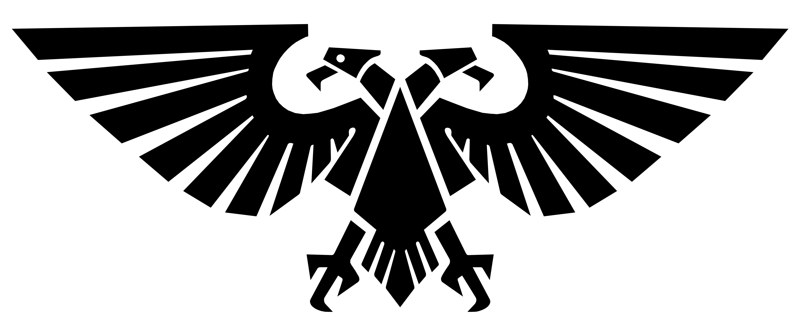
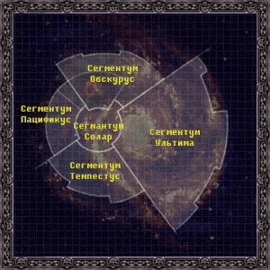

# Империум Человечества

Империум Человечества — это охватывающая всю галактику межзвездная Человеческая империя, высшая власть большинства людей в Галактике Млечный Путь в 41-м тысячелетии нашей эры. Им правит живой бог, известный как Император Человечества.

Тем не менее, есть и другие гуманоидные виды, классифицируемые как имперские граждане, в основном мутантные ответвления генетических исходных людей, которые известны как недолюди и включают такие человеческие подрасы, как огрины, ратлинги и сквоты.

Основателем и правителем Империума является богоподобный Император Человечества, самый могущественный из когда-либо рожденных людей-псайкеров. Император основал Империум более 10 000 терранских лет назад, в конце 30-го тысячелетия во время Войн за объединение на Старой Земле после ужасного периода в истории человечества, известного как Эпоха Раздора.

Император продолжает, по крайней мере номинально, править Империумом как его политический хозяин и его основная религиозная фигура. Однако Его сильно поврежденное тело погребено внутри кибернетических механизмов жизнеобеспечения тайного устройства, известного как Золотой Трон, после Его смертельного ранения во время древней межзвездной гражданской войны Ереси Хоруса.

Из-за этой ужасной судьбы Император не способен взаимодействовать с другими на ежедневной основе и оставил основное управление Своей Империей Сенаторуму Империалис, олигархическому правящему совету самых могущественных благородных лордов и адептов в мире. галактика. Senatorum Imperialis в настоящее время возглавляет генетический сын Императора, примарх Робаут Жиллиман, который возглавляет совет и направляет имперскую политику в качестве лорда-командующего Империума и имперского регента.

Империум Человечества — раздираемая войной звездная империя, балансирующая на грани краха. В течение 10 000 терранских лет им правил бессмертный Император, существо с почти безграничной психической силой, которому ежедневно приносятся в жертву тысячи душ, чтобы обеспечить Его психическую силу для поддержания коммуникаций и транспорта Империума.

Народы Империума живут в галактике, где демоны реальны, мутации часты, а смерть — постоянный спутник. Жить в 41-м тысячелетии — значит знать, что Вселенная — ужасное и враждебное место. Это место, где вы всего лишь один из миллиардов, и какой бы героической ни была ваша смерть, вас не будут хватать.

Поистине обширное владение, Империум раскинулось среди многих звезд галактики. Его территории охватывают неисчислимые миллионы звезд и бессчетное количество человеческих жизней.

Во имя него ведутся ужасные войны и приносятся отчаянные жертвы, но даже эта река бойни и крови — небольшая цена, ибо Империум — хранитель человечества. Если бы он ушел в небытие, то же самое произошло бы и с человечеством, уничтоженным бесчисленными врагами под рев смеха Темных Богов.

Империум — крупнейшая и в настоящее время самая могущественная политическая единица в галактике, состоящая как минимум из 1 000 000 населенных людьми миров, разбросанных по большей части Галактики Млечный Путь. Следовательно, имперская планета может быть отделена от своего ближайшего соседа сотнями или даже тысячами световых лет.

Как звездная империя, размер Империума не может быть измерен с точки зрения прилегающей территории, а только количеством планетарных систем, находящихся под его контролем. Однако большинство людей в галактике имеют мало повседневных контактов с правительством Империума, если только они не служат в одном из его Адептов или не вступают в конфликт с его различными защитниками, такими как Инквизиция или Адептус Арбитрес.

Империум — это прежде всего межзвездная империя дани, позволяющая входящим в его состав мирам в значительной степени управлять собой, пока они признают власть Императора и Его слуг и поддерживают государственную религию, Имперский Культ, который считает Императора единственным, истинным. Бог Человечества.

Каждый мир Империума также должен платить имперские налоги, взимаемые с них в виде войск и техники, известные как имперская десятина. Эти ресурсы идут на службу Астра Милитарум и Имперскому Флоту, вооруженным силам, которые поддерживают единство и безопасность Империума.

Имперская десятина поддерживает общую экономику Империума, перераспределяя ресурсы там, где это необходимо, обычно для поддержки одного региона Империи, где бушует конфликт, за счет привлечения ресурсов из более мирных секторов.

В целом, Империум способствует развитию неофеодальной политической системы, которую Верховные Лорды Терры и Инквизиция долгое время считали наиболее стабильной формой правления человечества. В галактике есть несколько миров, заселенных людьми, где кто-либо, кроме самых богатых дворян, имеет право голоса в управлении своей планетой, а имперский истеблишмент обычно характеризует любые движения к «демократии», самоуправлению или свержению нео- феодальную систему как откровенную ересь против божественного плана Бога-Императора.

Эта острая потребность в политической стабильности и растущие военные требования к имперской системе, представленные бесчисленными и растущими угрозами 41-го тысячелетия, создали репрессивное и застойное галактическое правительство.

В нынешнем Империуме наука и человеческий прогресс, по сути, остановились в угоду необходимости просто поддерживать рушащийся статус-кво. Недаром многие имперские ученые считают нынешнюю эпоху «Временем Конца» Человечества.

Несколько инопланетных видов и темных мистических сил — Хаос, тираниды, эльдари с искусственных миров, друкари, орки, тау и бессмертные некроны — теперь бросают вызов превосходству Империума и главенствующему положению человечества в галактике.

Изнутри его собственного скрипучего и все более застойного и репрессивного здания Империуму угрожают более коварные восстания, мутации, опасные псайкеры и подрывные культы Хаоса.

Однако, несмотря на множество проблем, без авторитарной и часто жесткой защиты Империума человечество в целом стало бы жертвой бесчисленных опасностей, которые ему угрожают. Без Империума Человечества и веры Человечества в Императора, который им руководит, человеческая раса давно бы вымерла.

