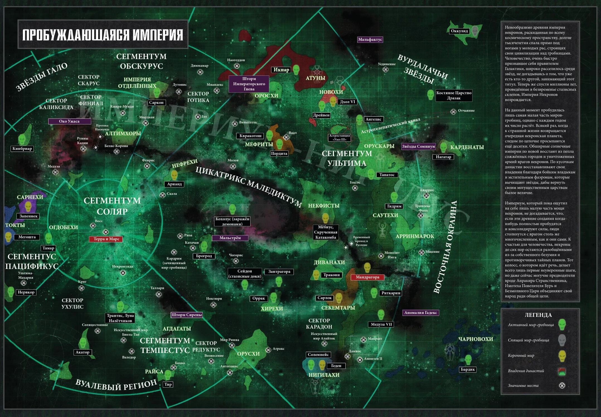

# Тау

Некроны — таинственная ксеносная раса гуманоидов, роботов-воинов-скелетов, которые дремали в своих стазисных гробницах более 60 миллионов терранских лет, хотя, наконец, они начали пробуждаться. Это бездушные создания и бывшие слуги древнего К'тана, ужасного Звездного Бога из мифа Аэльдари.

Некроны непостижимо древни, они появились еще до рождения альдари. Однако в конце концов они начинают пробуждаться из своих миров-гробниц, поскольку галактика созрела для завоевания и восстановления Империи Некронов после исчезновения Древних более 60 миллионов стандартных лет назад.

Некроны — это полностью роботизированный гуманоидный вид, чье технологическое мастерство, вероятно, не имеет себе равных среди других разумных видов галактики.

Тем не менее, из-за желания отомстить более удачливым долгоживущим древним ксеносам, называемым Древними, и из-за обмана богоподобных разумов, известных как К'тан, некроны сбросили свои первоначальные органические формы и утратили все формы сострадания. и сочувствие.

Вместо этого они стали безжалостными, бессмертными машинами для убийств, которые полны решимости снова проявить свое господство над галактикой.

По всей галактике этот древний и ужасный вид возвращается к жизни. Погребенные в стазисных склепах миллионы терранских лет, они дремали эоны, ожидая, пока галактика заживет от ран долгой и кровавой войны.

Теперь, после шестидесяти миллионов стандартных лет бездействия, начинается великая цель. В опустошенных мирах, которые, как считалось, давно лишились жизни, древние механизмы пробуждаются к мрачной цели, начиная медленный процесс возрождения, в результате которого те, кто погребен внутри, получат свободу, чтобы снова шагнуть к звездам. Неудержимые, бессмертные легионы некронов восстают. Пусть галактика остерегается.

Все некроны, от самых скромных воинов до самых царственных лордов, движимы одной конечной целью, восстановить славу своих древних правящих династий и снова подчинить себе галактику, как это было в древние времена.

Таков был указ, давным-давно закодированный в разумах некронов, и это приказ настолько фундаментален для их существования, что его нельзя отрицать. Тем не менее, это непростая задача, поскольку некроны пробуждаются из своих миров-гробниц, чтобы обнаружить, что галактика 41-го тысячелетия, как записано в Имперском календаре, сильно изменилась.

Многих миров-гробниц больше нет, они уничтожены космической катастрофой или инопланетным вторжением. Другие повреждены, их погребенные легионы поражены медленным безумием или стерты в пыль неудержимым натиском энтропии.

Выродившиеся инопланетные расы сидят на корточках среди руин тех миров-гробниц некронов, которые остались, мало осознавая, какое величие они оскверняют своим выскочкой. Но в таком невежестве нет спасения. Неумирающие пришли, чтобы вернуть свои земли, а живые будут сметены.

Тем не менее, если миллиарды некронов были уничтожены течением вечности, бессчетное количество миллиардов еще предстоит увидеть возрождение их владений. Эти некроны не существа из плоти и крови, а воины-андроиды, чьи бессмертные формы выкованы из живого металла. Таким образом, они почти не поддаются разрушению, а их механические тела быстро залечивают даже самые серьезные раны.

Со временем отрубленные конечности снова прикрепляются, броня восстанавливается, а разрушенные механические органы восстанавливаются. Таким образом, единственный способ обеспечить уничтожение некрона — это подавить его способность к самовосстановлению, нанести такой огромный урон, что его древние регенеративные системы не поспевают за ним.

Даже в этом случае, если произойдет непоправимый ущерб, некрон часто просто «поэтапно исчезает» — автоматический зеленовато-желтый луч телепортации возвращает его в безопасные стазис-склепы, где он остается в хранилище до тех пор, пока не будет проведен ремонт.

Науки, с помощью которых достигаются такие подвиги, остаются загадкой для посторонних, поскольку некроны не делятся своими секретами с меньшими расами и установили непредвиденные обстоятельства, чтобы предотвратить попадание своих высших технологий в чужие руки. Если павший воин-некрон не сможет исчезнуть, он самоуничтожится и поглотится вспышкой изумрудного света.

Внешне это мало чем отличается от свечения телепортации, заставляя врага задуматься, был ли некрон окончательно уничтожен или просто отступил в свою могилу. Поэтому победа над некронами всегда ненадежна, а с трудом выигранная битва дает мало гарантий окончательной победы.

Для некронов поражения — мелкие неудобства, прелюдия к будущим триумфам, не более того. Бессмертие принесло терпение; опасности, которые некроны пережили в древние времена, несут в себе урок, что их народ может преодолеть любое сопротивление, если у них есть желание попытаться. И если некроны обладают только одной чертой, то это воля несгибаемая, как адамантий.

Только одна надежда теперь может уберечь другие разумные виды галактики от наступления некронов, от бесконечных легионов безмолвных и бессмертных воинов, поднимающихся из давно забытых гробниц. Если некронам удастся помешать проснуться во всей своей красе, если разрозненным мирам-гробницам удастся помешать объединиться, тогда есть шанс выжить.

Если нет, то великие державы галактики обязательно падут, и некроны будут править вечно — бессмертные, жестокие и совершенно неумолимые.

## Расположение династий некронов в галактике

