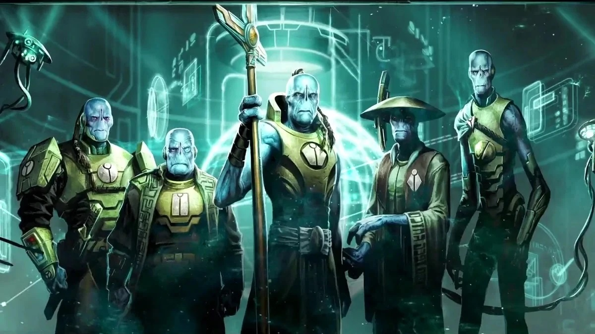
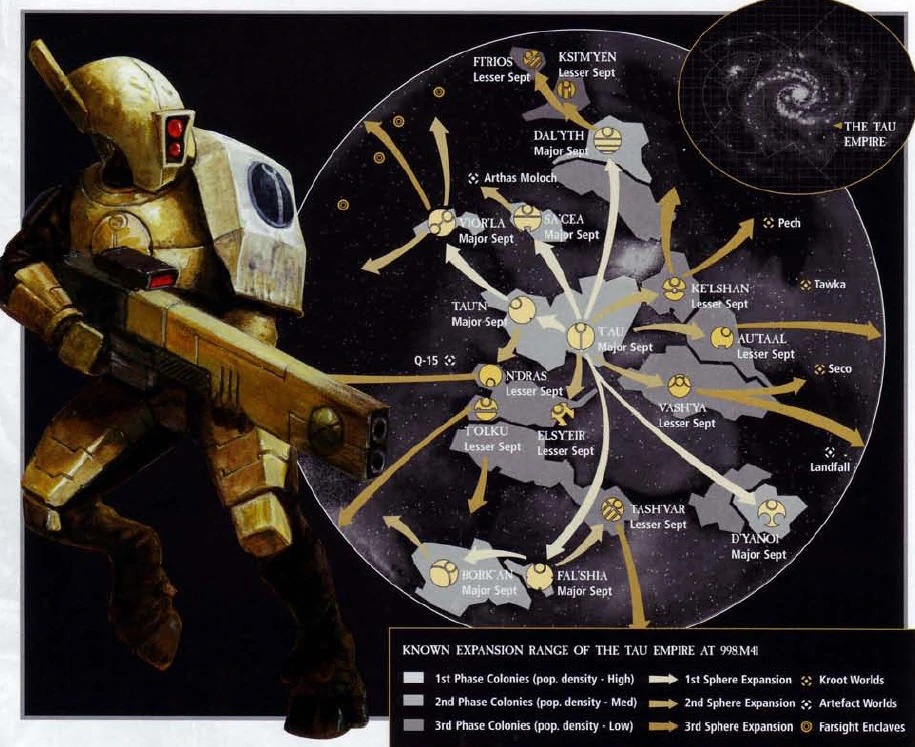
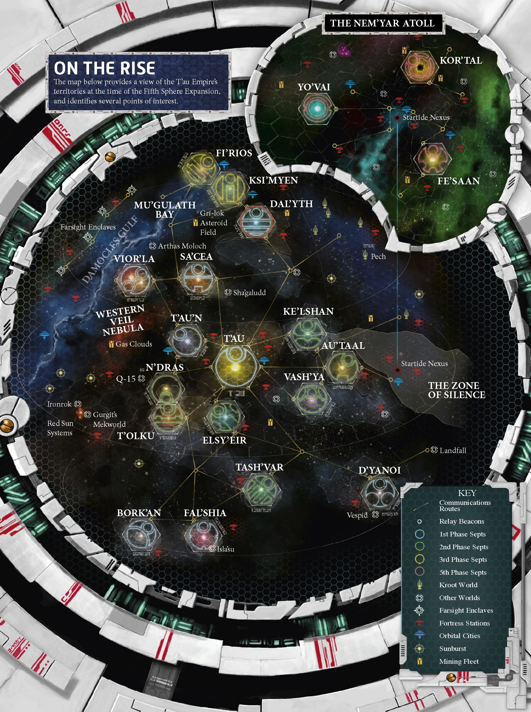

# Тау

Тау (Имперская биномиальная классификация: Тау тау), также пишется как Тау в более старых записях и произносится как «TOW», — молодые, гуманоидные и технологически продвинутая разумная раса, обитающая на восточных окраинах Галактики Млечный Путь.

Они борются за расширение своей межзвездной империи и распространение философской концепции, которую они называют «Великим Благом» (Тау'ва в лексиконе Тау), на все разумные виды галактики.

Тау утверждают, что являются мирным видом, когда это возможно, спрашивая, присоединятся ли другие к их делу добровольно, вместо того, чтобы сражаться против них.

Однако, если их мирные инициативы будут отвергнуты, Тау вполне могут решить завоевать планету и добавить ее к своей растущей межзвездной империи для Высшего Блага, сожгая плоть с костей любого, кто противостоит их добрым намерениям.

Общество тау разделено на несколько каст, каждая из которых отвечает за управление определенным аспектом своего общества. Центральный мотивирующий идеал Тау состоит в том, что каждый в их империи, независимо от вида их происхождения, будет работать для коллективного улучшения всех остальных, почти мистическую философию, которую они называют Высшим Благом.

Тау - центральные фигуры Империи Тау, межзвездного государства, состоящего из нескольких различных разумных видов, в первую очередь крутов Печа, Веспидов мира Веспид и кочевников Никассар.

Тем не менее, в настоящее время есть несколько человеческих септ Тау, происходящих от завоеванных имперских людей или людей, которые добровольно присоединились к Империи Тау, потому что они были впечатлены концепцией Высшего Блага.

Эти люди известны как Гуэ'веса в лексиконе Тау, и они считаются одними из самых мерзких предателей и еретиков в Империуме Человечества.

Тау — относительно молодой вид (прошло всего 6000 терранских лет с тех пор, как имперские инквизиторы впервые заметили, что тау только что освоили огонь и колесо), и за последние несколько тысячелетий они быстро эволюционировали.

В отличие от других молодых разумных рас галактики, тау совершили значительный прорыв в технологиях и теперь представляют реальную угрозу имперскому господству в их регионе галактики.

## Активность тау в галактике

