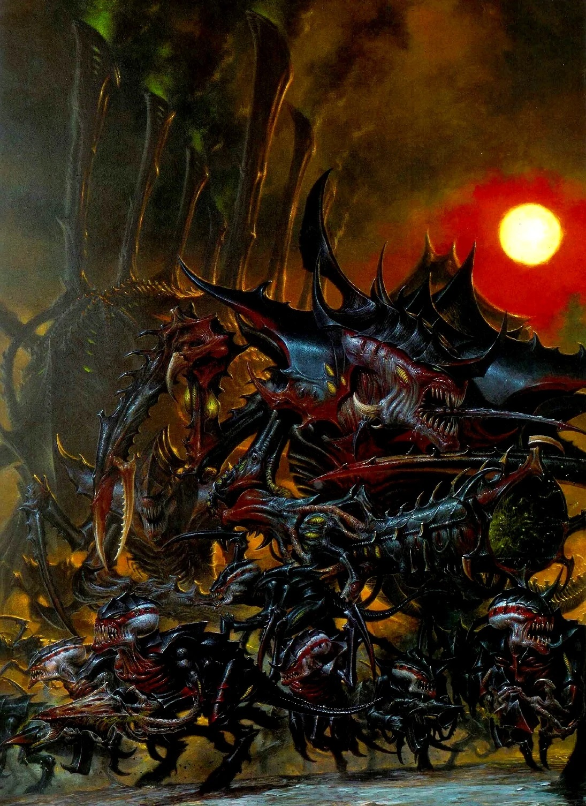
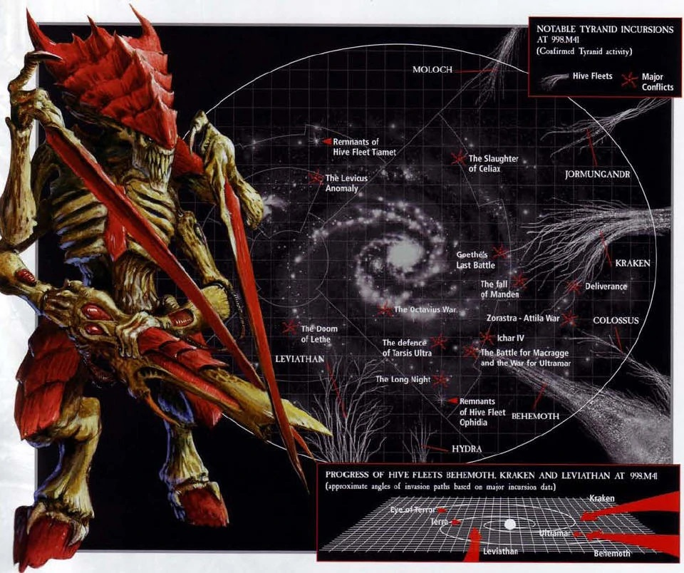
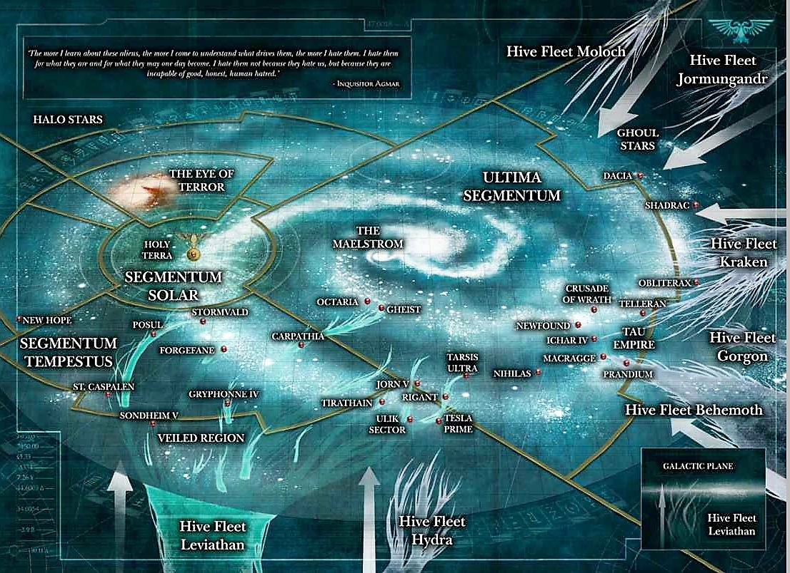
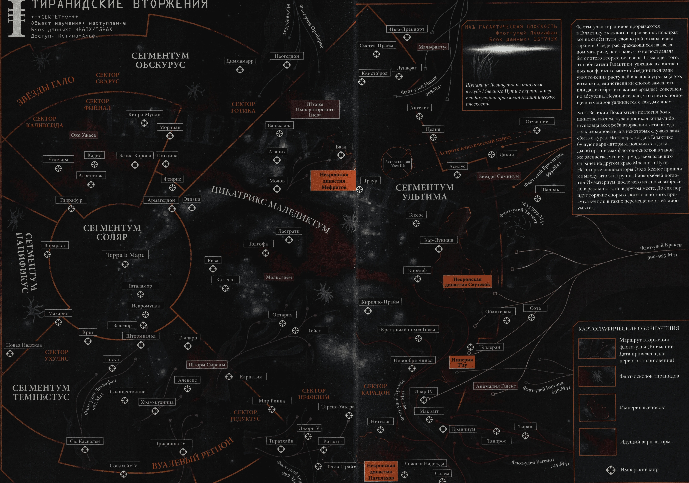

*Тираниды*

Тираниды — внегалактическая смешанная раса отвратительных насекомоподобных ксеносов. На самом деле они представляют собой целую космическую экосистему, состоящую из бесчисленного множества различных биоформ, являющихся вариациями одной и той же генетической темы.

Тираниды не похожи ни на какие другие разумные виды, с которыми сталкивается человечество. Они настоящие хищники; для них все живые существа, от самых непритязательных насекомых до самых передовых цивилизаций, путешествующих по звездам, являются простой добычей. Только сейчас жители галактики осознают масштаб угрозы; если тиранидов не удастся остановить, это будет означать не что иное, как исчезновение всего живого.

Вид тиранидов в конечном счете посвящен исключительно собственному выживанию, размножению и эволюционному развитию. Вместе тираниды образуют чудовищный сверхорганизм, который путешествует по вселенной на своих огромных флотах-ульях биомеханических кораблей-ульев, систематически потребляя всю остальную биоматерию, чтобы обеспечить свою быструю эволюцию и размножение.

Тираниды уподоблены галактическому рою, поглощающему все на своем пути, пожирающему целые миры и оставляющему за собой лишь мертвую шелуху. Их угроза такова, что незащищенная планета может быть заражена и очищена от всего органического материала в течение нескольких солнечных недель, даже не замедляя продвижение флота-улья.

Все тиранидские организмы являются «синаптическими» (психически-реактивными), и каждое тиранидское существо во флоте-улье разделяет и вносит свой вклад в общий разум улья, что позволяет триллионам существ, составляющих флоты-ульи, общаться и организовываться мгновенно в ошеломляющем масштабе. .

Менталитет тиранидского подхода к войне можно описать фразой «количество имеет собственное качество». От «непритязательного» Потрошителя до смертоносного Тирана Улья и выше, отличительной чертой расы тиранидов является то, что они сокрушают своих врагов огромным числом, воспроизводя огромное количество высокоопасных организмов в рекордно короткие сроки из биохимического супа, который они получают из биосферы потребляемых ими миров.

Компоненты флота-улья тиранидов путешествуют почти исключительно большими группами, известными как «рои», которые обладают специализированными биомеханическими существами для уничтожения и поедания самых разнообразных форм жизни-жертв.

Тираниды разработали сложные методы для облегчения генетической передачи через границы видов. В результате важной целью любого вторжения тиранидов является приобретение новых полезных биологических черт от других форм жизни.

Они используются Разумом Улья для повышения эффективности Тиранидов в поглощении новых миров, чтобы получить больше необходимого органического сырья для дальнейшего размножения и направленной эволюции. Все тираниды воспроизводятся одной очень разумной женской биоформой, известной как королева улья.

Королева улья флота-улья являются самыми важными тиранидами во флоте, поскольку, если они ранены или убиты, тираниды не могут воспроизвести свою численность из захваченной биомассы. В результате Королевы ульев можно найти только в центре самых больших и хорошо защищенных кораблей-ульев тиранидов.

